# Testing Refresh Token Mechanism

## Overview

This guide explains how to test the automatic refresh token mechanism in your React Native Auth Client library. The library provides special testing methods that allow you to simulate expired tokens and verify that the refresh flow works correctly.

---

## 🎯 Purpose

The refresh token testing features allow you to:

1. **Inspect Token State** - Check if tokens exist, are valid, and when they expire
2. **Simulate Token Expiration** - Set expired tokens to test automatic refresh
3. **Verify Refresh Flow** - Ensure requests automatically retry with refreshed tokens
4. **Test Error Handling** - Verify proper behavior when refresh fails

---

## 🚀 Quick Start

### Step 1: Authenticate

First, authenticate to get valid tokens:

```typescript
import AuthClient from 'react-native-auth-client';

await AuthClient.authenticate('api/authenticate', {
  username: 'testuser',
  password: 'password123'
});
```

### Step 2: Check Token Status

```typescript
const tokenInfo = await AuthClient.getTokenInfoForTesting();

console.log('Has Access Token:', tokenInfo.hasAccessToken);
console.log('Has Refresh Token:', tokenInfo.hasRefreshToken);
console.log('Is Expired:', tokenInfo.isExpired);
console.log('Expires At:', tokenInfo.expirationDate);
```

### Step 3: Invalidate Tokens

```typescript
// This sets an expired access token
await AuthClient.invalidateTokensForTesting();
```

### Step 4: Test Automatic Refresh

```typescript
// This should trigger an automatic token refresh
const result = await AuthClient.get('api/user/profile');

// If successful, the token was automatically refreshed!
console.log('Request succeeded:', result);
```

---

## 📱 Testing Methods API

### 1. `getTokenInfoForTesting()`

Returns current token status and expiration information.

**Response:**

```typescript
{
  hasAccessToken: boolean;        // True if access token exists
  hasRefreshToken: boolean;       // True if refresh token exists
  isExpired: boolean;             // True if access token is expired
  accessTokenPreview?: string;    // First 50 chars of access token
  refreshTokenPreview?: string;   // First 50 chars of refresh token
  expirationDate?: string;        // Human-readable expiration date
  expirationTimestamp?: number;   // Unix timestamp (seconds)
}
```

**Example:**

```typescript
const info = await AuthClient.getTokenInfoForTesting();

if (info.isExpired) {
  console.log('Token expired at:', info.expirationDate);
} else {
  console.log('Token valid until:', info.expirationDate);
}
```

---

### 2. `invalidateTokensForTesting()`

Sets the access token to an expired test token. The refresh token remains valid.

**What it does:**
- **iOS**: Sets access token to a JWT that expired in 2024
- **Android**: Sets access token to a JWT that expired in 2024 and updates expiry timestamp

**Response:**

```typescript
{
  success: boolean;
  message: string;
}
```

**Example:**

```typescript
await AuthClient.invalidateTokensForTesting();
console.log('Access token is now expired');

// Next API call will trigger automatic refresh
const result = await AuthClient.get('api/data');
```

**Use Cases:**
- ✅ Test automatic token refresh on API requests
- ✅ Verify refresh flow works correctly
- ✅ Test 401 handling and retry logic
- ✅ Debug refresh-related issues

---

### 3. `clearTokensForTesting()`

Completely removes all tokens from storage.

**What it does:**
- Clears access token
- Clears refresh token
- Clears token expiry information
- Clears refresh token expiry information

**Response:**

```typescript
{
  success: boolean;
  message: string;
}
```

**Example:**

```typescript
await AuthClient.clearTokensForTesting();
console.log('All tokens cleared');

// User is now logged out
// Next authenticated request will fail with 401
```

**Use Cases:**
- ✅ Test login flow from scratch
- ✅ Verify behavior when tokens are missing
- ✅ Test logout functionality
- ✅ Reset authentication state for testing

---

## 🧪 Test Scenarios

### Scenario 1: Basic Refresh Flow

**Test:** Verify automatic token refresh works

```typescript
// 1. Authenticate
await AuthClient.authenticate('api/authenticate', {
  username: 'user',
  password: 'pass'
});

// 2. Verify tokens are valid
let info = await AuthClient.getTokenInfoForTesting();
console.assert(info.hasAccessToken && !info.isExpired);

// 3. Invalidate access token
await AuthClient.invalidateTokensForTesting();

// 4. Verify token is now expired
info = await AuthClient.getTokenInfoForTesting();
console.assert(info.isExpired === true);

// 5. Make a request - should auto-refresh
const result = await AuthClient.get('api/user/profile');

// 6. Verify token was refreshed
info = await AuthClient.getTokenInfoForTesting();
console.assert(info.isExpired === false);
console.log('✅ Token automatically refreshed!');
```

---

### Scenario 2: Multiple Concurrent Requests

**Test:** Verify only one refresh happens for concurrent requests

```typescript
// 1. Invalidate tokens
await AuthClient.invalidateTokensForTesting();

// 2. Make multiple requests simultaneously
const [result1, result2, result3] = await Promise.all([
  AuthClient.get('api/user/profile'),
  AuthClient.get('api/user/settings'),
  AuthClient.get('api/user/preferences')
]);

// All should succeed
console.log('✅ All requests succeeded');
console.log('✅ Only one token refresh should have occurred');
```

---

### Scenario 3: Refresh Token Failure

**Test:** Verify behavior when refresh token is invalid

```typescript
// 1. Clear all tokens
await AuthClient.clearTokensForTesting();

// 2. Try to make a request
try {
  await AuthClient.get('api/user/profile');
  console.error('❌ Should have thrown an error');
} catch (error) {
  console.log('✅ Request failed as expected:', error);
}
```

---

### Scenario 4: Token Expiration Edge Case

**Test:** Verify proactive refresh before expiration

```typescript
// 1. Check current token expiration
const info = await AuthClient.getTokenInfoForTesting();
console.log('Token expires at:', info.expirationDate);

// 2. If expiring soon, next request should refresh proactively
const result = await AuthClient.get('api/user/profile');

// 3. Check if token was refreshed
const newInfo = await AuthClient.getTokenInfoForTesting();
console.log('New expiration:', newInfo.expirationDate);
```

---

## 📋 Test Checklist

Use this checklist to verify refresh token functionality:

### ✅ Basic Functionality
- [ ] Tokens are stored after authentication
- [ ] Access token is included in API requests
- [ ] Token expiration is correctly parsed

### ✅ Refresh Flow
- [ ] Expired access token triggers refresh
- [ ] Refresh endpoint is called with refresh token
- [ ] New tokens are stored after successful refresh
- [ ] Original request is retried with new token
- [ ] Subsequent requests use the new token

### ✅ Error Handling
- [ ] Missing refresh token returns error
- [ ] Invalid refresh token returns error
- [ ] Failed refresh clears tokens (optional)
- [ ] User is prompted to login again

### ✅ Concurrency
- [ ] Multiple requests don't trigger multiple refreshes
- [ ] Concurrent requests wait for refresh to complete
- [ ] All concurrent requests succeed after refresh

### ✅ Edge Cases
- [ ] Proactive refresh before token expires
- [ ] Token refresh with encryption enabled
- [ ] Token refresh after app restart
- [ ] Token refresh on slow network

---

## 🎨 UI Testing Guide (Example App)

The example app (`AuthClientTestScreen.tsx`) includes a dedicated "Token Testing" section.

### Using the Test Screen

1. **Initialize & Authenticate**
   - Enter your API credentials
   - Click "Initialize Client"
   - Click "Authenticate"

2. **Open Token Testing Section**
   - Scroll to "🧪 Token Testing (Dev Only)"

3. **Get Token Status**
   - Click "📊 Get Token Status"
   - View current token state in alert

4. **Simulate Expired Token**
   - Click "⏰ Set Expired Tokens"
   - Token is now expired but refresh token is valid

5. **Test Automatic Refresh**
   - Click "🔽 HTTP GET Request" or "🔼 HTTP POST Request"
   - Check response - should succeed after refresh
   - Check device logs for refresh messages

6. **Clear Tokens**
   - Click "🗑️ Clear All Tokens"
   - Tokens are completely removed
   - Next request will fail with 401

---

## 🔍 Debugging Tips

### Check Native Logs

**iOS (Xcode Console):**
```
🌐 NetworkService initialized with timeout: 30.0s
🔑 POST request with auth token
📡 HTTP Response Status: 401
🔄 Refreshing access token...
🔑 Token refresh successful
📡 HTTP Response Status: 200
```

**Android (Logcat):**
```
D/AuthClientWrapper: Access token expired, refreshing...
D/TokenRefreshService: Refreshing token with refresh token: eyJ...
D/TokenRefreshService: Token refresh successful
D/AuthClientWrapper: Request succeeded after token refresh
```

### Common Issues

| Issue | Cause | Solution |
|-------|-------|----------|
| Refresh always fails | Refresh token invalid | Re-authenticate to get new tokens |
| Infinite refresh loop | Backend not issuing new tokens | Check API response format |
| No automatic refresh | Token not detected as expired | Check token expiry parsing |
| Race condition | Multiple refreshes triggered | Check deduplication logic |

---

## 🎭 Mock Refresh Token Flow

For unit tests, you can mock the refresh behavior:

```typescript
// Mock expired token
jest.mock('react-native-auth-client', () => ({
  getTokenInfoForTesting: jest.fn().mockResolvedValue({
    hasAccessToken: true,
    hasRefreshToken: true,
    isExpired: true,
    expirationDate: '2024-06-09 10:45:45'
  }),
  invalidateTokensForTesting: jest.fn().mockResolvedValue({
    success: true,
    message: 'Tokens invalidated'
  }),
  get: jest.fn()
    .mockRejectedValueOnce(new Error('401 Unauthorized')) // First call fails
    .mockResolvedValueOnce({ data: 'success' }) // Retry succeeds
}));

// Test
await expect(AuthClient.get('/api/data')).resolves.toEqual({ data: 'success' });
```

---

## 🚦 Testing Workflow

### Recommended Testing Sequence

```mermaid
graph TD
    A[Authenticate] --> B[Check Token Status]
    B --> C[Verify Tokens Valid]
    C --> D[Invalidate Tokens]
    D --> E[Make API Request]
    E --> F{Request Succeeded?}
    F -->|Yes| G[✅ Refresh Worked]
    F -->|No| H[❌ Debug Logs]
    H --> I[Check Refresh Token]
    I --> J[Re-authenticate]
    J --> D
```



---

## 📊 Platform-Specific Behavior

### iOS Implementation

**File:** `ios/AuthClient/Services/NetworkService.swift`

- **Storage:** Keychain (secure)
- **Refresh Logic:** Automatic on 401 response
- **Deduplication:** Single `Task` instance prevents concurrent refreshes
- **Retry:** One automatic retry after refresh

**Key Functions:**
- `getValidAccessToken()` - Checks expiry before requests
- `refreshAccessToken()` - Handles refresh flow
- `handleUnauthorizedAndRetry()` - Retries after 401

### Android Implementation

**File:** `android/src/main/java/com/reactnativeauthclient/services/ApiService.kt`

- **Storage:** EncryptedSharedPreferences (secure)
- **Refresh Logic:** Automatic on 401 response
- **Deduplication:** Synchronized block prevents concurrent refreshes
- **Retry:** One automatic retry after refresh

**Key Functions:**
- `getAccessToken()` - Checks expiry before requests
- `refreshAccessToken()` - Handles refresh flow
- `makeAuthenticatedRequest()` - Main request handler with retry

---

## 🔐 Security Considerations

### ⚠️ Important Notes

1. **Production Use**: These testing methods should be **disabled or removed** in production builds
2. **Sensitive Data**: Token previews only show first 50 characters
3. **Logging**: Disable token logging in production
4. **Storage**: Tokens are stored securely (Keychain/EncryptedSharedPreferences)

### Recommended Production Guards

```typescript
// Add to your code
const isDevelopment = __DEV__;

if (isDevelopment) {
  // Testing methods available
  await AuthClient.invalidateTokensForTesting();
} else {
  throw new Error('Testing methods not available in production');
}
```

Or remove from TurboModule spec for production builds.

---

## 📚 Related Documentation

- [Refresh Token Flow Documentation](./ios/AuthClient/Services/REFRESH_TOKEN_README.md)
- [iOS NetworkService Implementation](./ios/AuthClient/Services/NetworkService.swift)
- [Android TokenRefreshService Implementation](./android/src/main/java/com/reactnativeauthclient/services/TokenRefreshService.kt)
- [Error Handling Guide](./README.md#error-handling)

---

## 🎯 Success Criteria

Your refresh token mechanism is working correctly if:

✅ Expired tokens automatically trigger refresh
✅ Original request succeeds after refresh
✅ New tokens are stored and used for subsequent requests
✅ Concurrent requests don't cause multiple refreshes
✅ Invalid refresh tokens properly fail and clear state
✅ Refresh works with both GET and POST requests
✅ Refresh works with encrypted and non-encrypted modes

---

## 💡 Tips & Tricks

### 1. Test with Encryption On/Off

The refresh mechanism should work regardless of encryption settings:

```typescript
// Test with encryption enabled
await AuthClient.initialize({
  baseUrl: 'https://api.example.com',
  isEncryptionRequired: true,
  clientId: 'client-123',
  passPhrase: 'secret-key'
});

// Test refresh flow...

// Test with encryption disabled
await AuthClient.initialize({
  baseUrl: 'https://api.example.com',
  isEncryptionRequired: false,
  clientId: 'client-123',
  passPhrase: 'secret-key'
});

// Test refresh flow again...
```

### 2. Monitor Network Traffic

Use a proxy (Charles, Proxyman) to see actual HTTP requests:

1. Watch for 401 response
2. See refresh endpoint called
3. Verify retry with new token
4. Confirm 200 success

### 3. Test Token Rotation

If your backend implements refresh token rotation:

```typescript
// 1. Get initial refresh token
const info1 = await AuthClient.getTokenInfoForTesting();
console.log('Refresh token:', info1.refreshTokenPreview);

// 2. Trigger refresh
await AuthClient.invalidateTokensForTesting();
await AuthClient.get('api/data');

// 3. Check if refresh token changed
const info2 = await AuthClient.getTokenInfoForTesting();
console.log('New refresh token:', info2.refreshTokenPreview);

// Should be different if rotation is enabled
console.assert(info1.refreshTokenPreview !== info2.refreshTokenPreview);
```

---

## 🆘 Support

If you encounter issues:

1. Check native logs (Xcode/Logcat)
2. Verify backend returns proper token format
3. Ensure refresh endpoint is correct
4. Test with encryption disabled first
5. Create an issue with logs and steps to reproduce

---

**Last Updated:** 2025-12-08
**Version:** 0.2.9+
